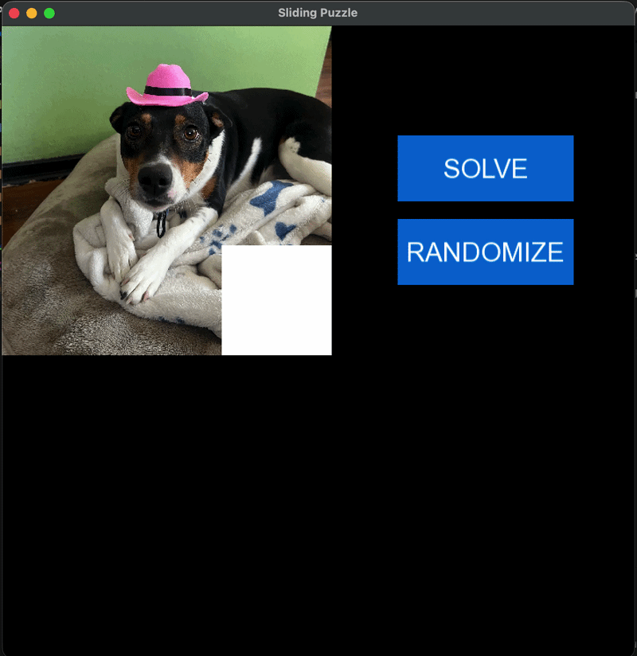
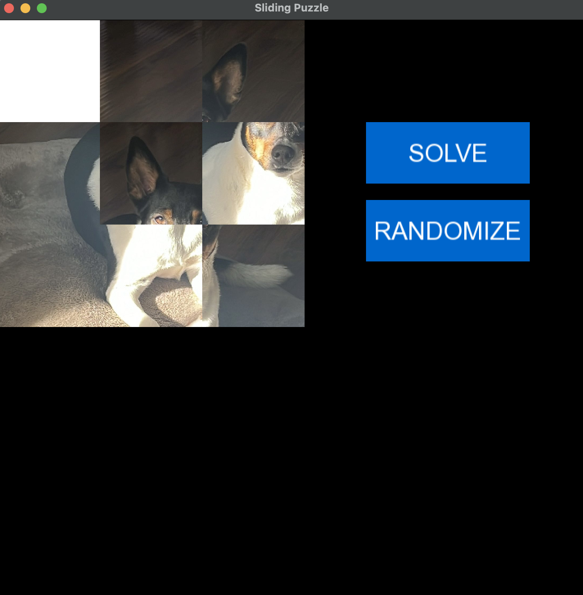
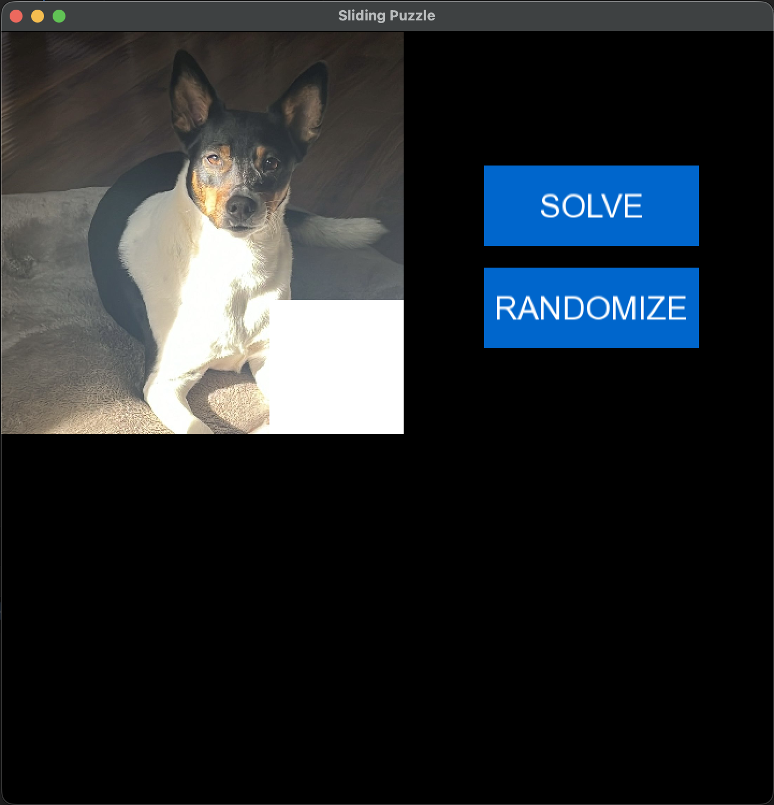

# Sliding Puzzle Solver (A* Algorithm)

### to run: ./cmake-build-debug/MalenaTest

## Overview

**Sliding Puzzle Solver** is a 3×3 sliding puzzle game that uses the **A*** (A-Star) search algorithm to automatically solve the puzzle.

Users can upload any **square image**, which is then:

* Sliced into a 3×3 grid
* One tile is removed and replaced with a blank space
* Each tile is assigned a numeric value
* The A* algorithm computes the optimal sequence of moves
* The blank tile moves to simulate a real sliding puzzle game

The result is a visual demonstration of informed search using heuristic functions.

---

## Demo



---

## Features

* Upload any square image
* Automatic image slicing into 3×3 tiles
* Interactive sliding puzzle layout
* A* search algorithm implementation
* Heuristic-based optimal path finding
* Visual simulation of puzzle-solving process
* Blank tile movement mimics real sliding mechanics

---

## How It Works

### 1. Image Processing

* The user uploads a square image.
* The image is divided into **9 equal sections**.
* One tile is removed and replaced with a blank square.
* Each tile is assigned a numeric value (1–8).
* The blank tile is represented as 0.

Example state representation:

```
1 2 3
4 5 6
7 8 0
```

---

### 2. State Representation

The puzzle state is stored as a 2D grid or flattened array.

Each move:

* Swaps the blank tile (0) with one of its valid neighbors
* Generates a new state
* Adds it to the search frontier

---

### 3. A* Search Algorithm

The solver uses the A* algorithm:

```
f(n) = g(n) + h(n)
```

Where:

* `g(n)` = Cost from start node to current node
* `h(n)` = Heuristic estimate from current node to goal
* `f(n)` = Total estimated cost

---

### 4. Heuristic Function

The heuristic function used is typically:

#### Manhattan Distance

For each tile:

```
|x1 - x2| + |y1 - y2|
```

This calculates the total distance each tile is from its goal position.

Why Manhattan Distance?

* Admissible
* Consistent
* Guarantees optimal solution with A*

---

### 5. Puzzle Solving Process

1. Initial state is added to priority queue.
2. The state with lowest `f(n)` is expanded.
3. Neighbor states are generated by moving the blank tile.
4. Visited states are tracked to avoid repetition.
5. The process continues until goal state is reached.

---

## Algorithm Complexity

* **Time Complexity:** O(b^d)
* **Space Complexity:** O(b^d)

Where:

* `b` = branching factor (max 4 for sliding puzzle)
* `d` = depth of solution

For a 3×3 puzzle, this remains computationally manageable.

---

## Project Structure

```
/State
  State.h

/A_Star
  A_Star.h

/Game
  /doggy pics
  Game.h
```

---

## Technologies Used

* C++
* A* Search Algorithm
* Heuristic Search (Manhattan Distance)
* MALENA (SFML)
* Image slicing logic

---

## Example Puzzle States

Initial State:



Solved State:



---

## Key Concepts Demonstrated

* Informed search algorithms
* Heuristic functions
* Graph traversal
* State-space exploration
* Priority queues
* Optimal pathfinding
* Game state modeling

---

## Future Improvements

* Support for 4×4 (15-puzzle)
* Multiple heuristic options (e.g., misplaced tiles)
* Adjustable animation speed
* Step-by-step solution visualization
* Solvability checker before solving
* Performance metrics display

---

## Learning Outcomes

This project demonstrates:

* Practical implementation of A*
* Real-world use of heuristics
* Algorithm optimization techniques
* Interactive algorithm visualization
* Problem modeling in AI

---

## Author

Pablo Ruiz
Computer Science Student
Software Developer

---

## License

This project is for educational purposes.
